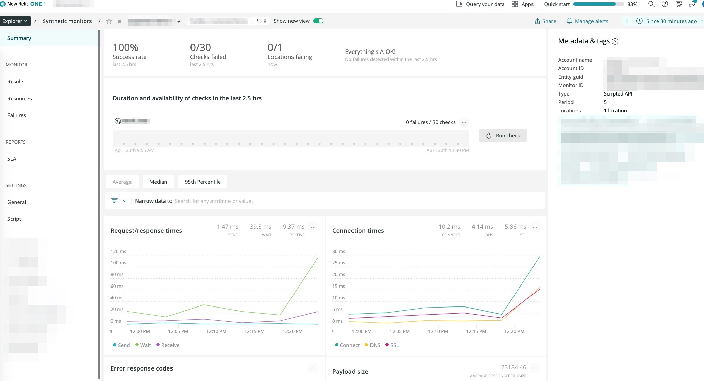
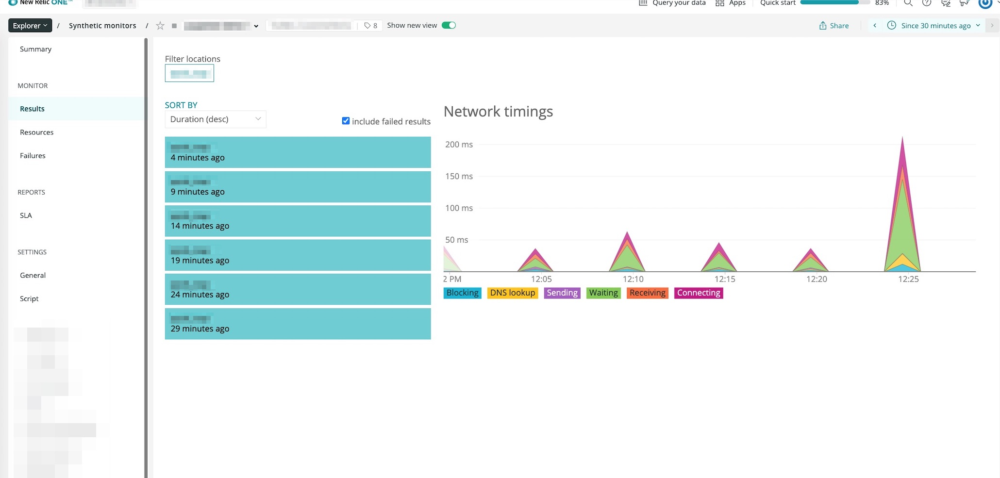
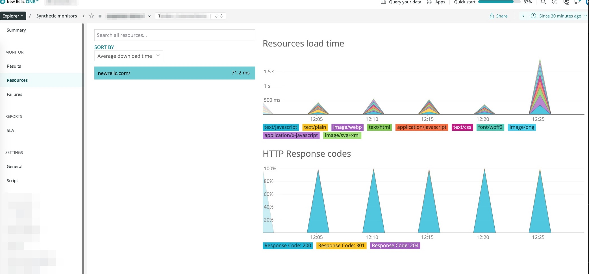
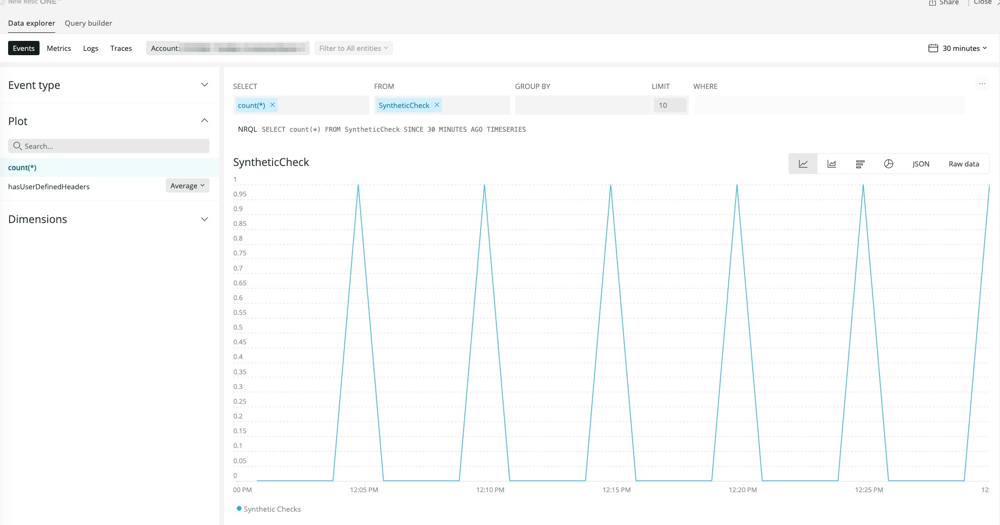
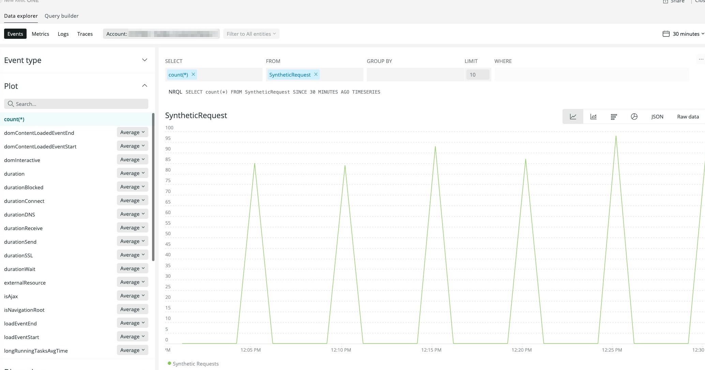
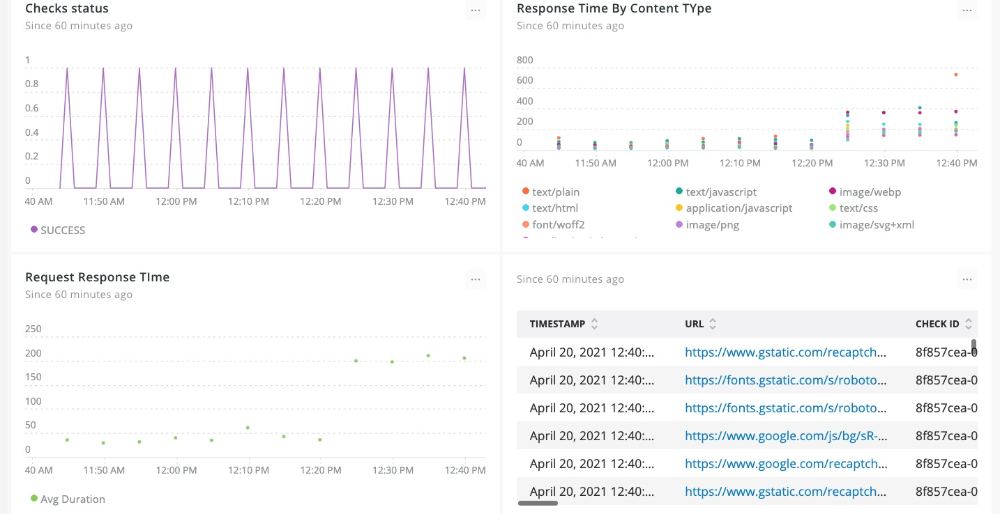

[](https://opensource.newrelic.com/oss-category/#new-relic-experimental)

# New Relic Synthetics Private Minion with Puppeteer Demo


A New Relic Synthetic [Private minion](https://docs.newrelic.com/docs/synthetics/synthetic-monitoring/private-locations/install-containerized-private-minions-cpms/) configured with [Puppeteer](https://developers.google.com/web/tools/puppeteer) for running UI tests using New Relic Synthetic API monitor.

**What is Puppeteer**

[Puppeteer](https://developers.google.com/web/tools/puppeteer) is a Node library which provides a high-level API to control headless Chrome or Chromium over the DevTools Protocol. It can also be configured to use full (non-headless) Chrome or Chromium.

**The purpose of this POC**
- Allow users to test with a specific Chrome browser version by installing the appropraiate Puppeteer library.
- Allow users to write UI utomation tests and capture site performance  using Puppeteer API
- Demonstrate publishing event data to NR1 platform using  [New Relic Events API](https://docs.newrelic.com/docs/telemetry-data-platform/ingest-manage-data/ingest-apis/introduction-event-api/).
>  Note:
Not all SyntheticRequest event metrics are populated.
See [syntheticrequest-parser](./custom-modules/syntheticrequest-parser/index.js) for details (work in progress).

## Requirements
* Linux or Mac
* [Docker](https://docs.docker.com/get-docker/)
* [NodeJS](https://nodejs.org/en/download/)
* [New Relic Containerized Private Minion](https://docs.newrelic.com/docs/synthetics/synthetic-monitoring/private-locations/install-containerized-private-minions-cpms/)

>NOTE: Metrics are only visible on the new Synthetics Summary UI when the `Show new view`  button is enabled on the Synthetics Summary UI.


## Installation
### New Relic Containerized Private Minion

* Step-1: Create a Synthetics Private Minion in your NR1 UI see steps [here](https://docs.newrelic.com/docs/synthetics/synthetic-monitoring/private-locations/install-containerized-private-minions-cpms/).

* Step-2: Copy the Private minion location key from NR1 Private location UI and modify the CPM location key in file `start.sh`.
  ```
  // File: start.sh
  export PVT_LOCATION_KEY="aaaaa-bbbbbb-ccccc-dddd-eeee
  ```

  Start the Synthetics Private minion
  ```
  $> ./start.sh
  ```


## Getting Started

* Step-1:  Install and configure a containerized private minon see [Installation step](#installation).

* Step-2: Create a Synthetics API test see intructions [here](https://docs.newrelic.com/docs/synthetics/synthetic-monitoring/using-monitors/add-edit-monitors/#complex) for details.
Select the private minion you've created when selecting a [location](https://docs.newrelic.com/docs/synthetics/synthetic-monitoring/using-monitors/add-edit-monitors/#setting-location).  After saving take note of your monitors GUID in the `Metadata & Tags` widget in monitor summary page see [here](https://docs.newrelic.com/docs/synthetics/synthetic-monitoring/pages/synthetic-monitoring-summary/).


* Step-3: Edit your API Test and replace the source with api-test.js make sure to update these properties
  ```

  const insightsKey='<YOUR_INSIGHTS_KEY>'

  const customEnv={
    ENTITY_GUID:'<YOUR_API_TEST_GUID>',
    MINION:'CUSTOM_MINION',
    MINION_ID:'000',
    LOCATION_LABEL:'CUSTOM_LOCATION_LABEL'
  };
  ```

* Step-4: validate and save.


## Screenshots








## Support

New Relic hosts and moderates an online forum where customers can interact with New Relic employees as well as other customers to get help and share best practices. Like all official New Relic open source projects, there's a related Community topic in the New Relic Explorers Hub.


## Contributing
We encourage your contributions to improve [project name]! Keep in mind when you submit your pull request, you'll need to sign the CLA via the click-through using CLA-Assistant. You only have to sign the CLA one time per project.
If you have any questions, or to execute our corporate CLA, required if your contribution is on behalf of a company,  please drop us an email at opensource@newrelic.com.

**A note about vulnerabilities**

As noted in our [security policy](../../security/policy), New Relic is committed to the privacy and security of our customers and their data. We believe that providing coordinated disclosure by security researchers and engaging with the security community are important means to achieve our security goals.

If you believe you have found a security vulnerability in this project or any of New Relic's products or websites, we welcome and greatly appreciate you reporting it to New Relic through [HackerOne](https://hackerone.com/newrelic).

## License
New Relic Synthetics Private Minion with Puppeteer Demo is licensed under the [Apache 2.0](http://apache.org/licenses/LICENSE-2.0.txt) License.
>[If applicable: The New Relic Synthetics Private Minion with Puppeteer Demo also uses source code from third-party libraries. You can find full details on which libraries are used and the terms under which they are licensed in the third-party notices document.]
### Third party Library Notices
- [puppeteer]  - [License](https://github.com/puppeteer/puppeteer/blob/main/LICENSE)
- [chrome-har] - [License](https://github.com/sitespeedio/chrome-har/blob/main/LICENSE)
- [moment.js]  - [License](https://github.com/moment/moment/blob/develop/LICENSE)
- [urllib]     - [License](https://github.com/node-modules/urllib/blob/master/LICENSE)
